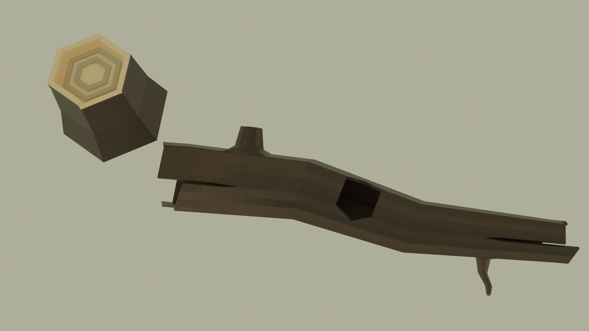
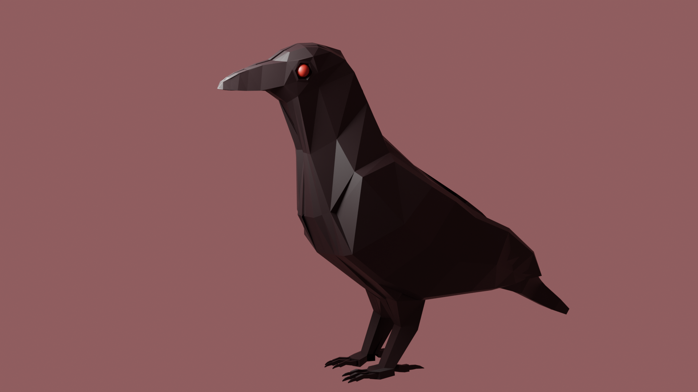
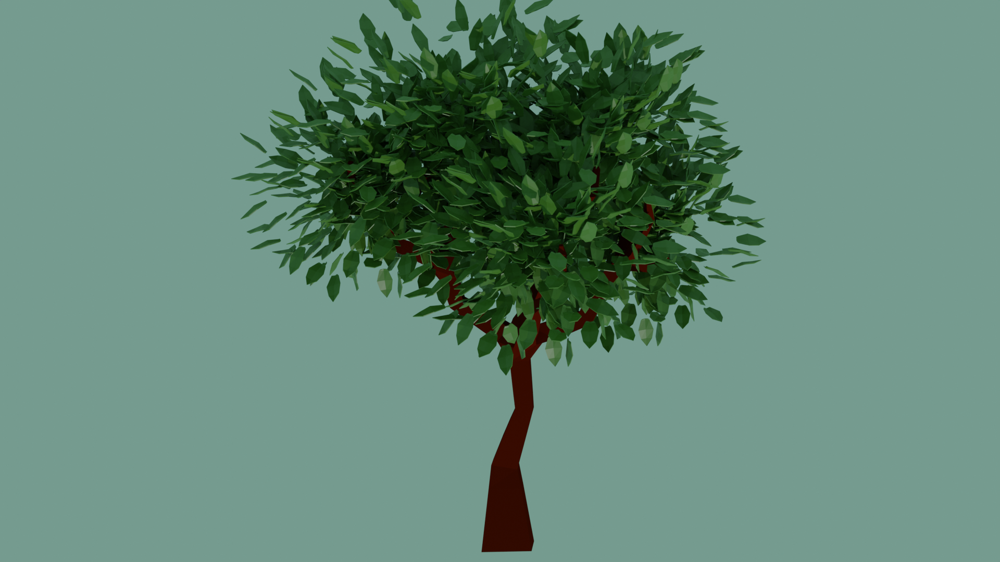
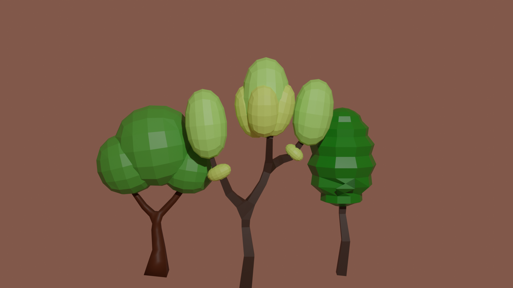
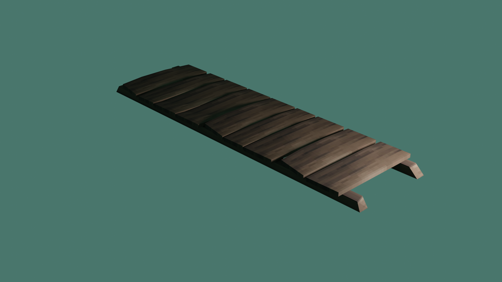
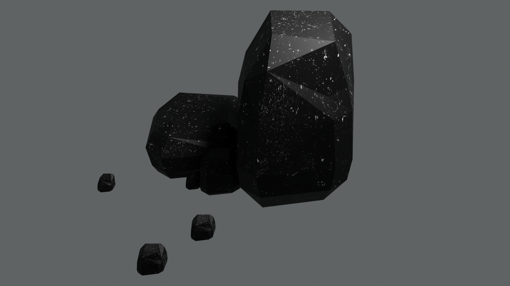
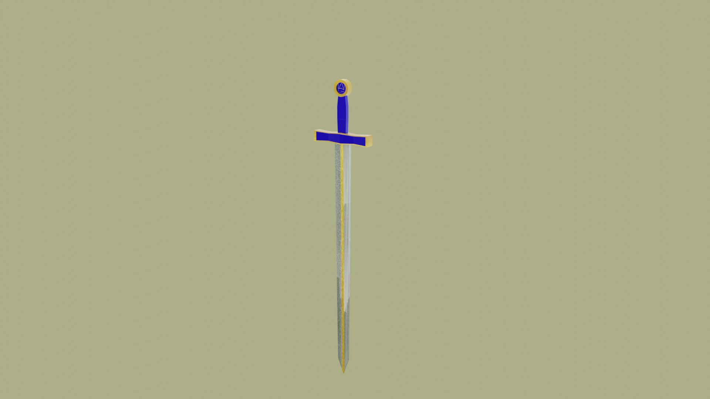
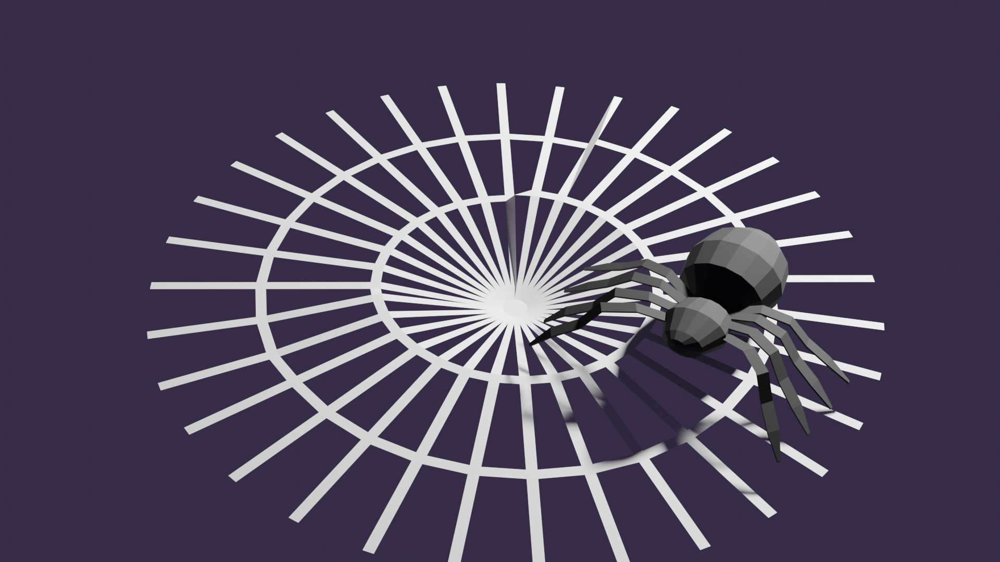

## Blender-3D-Assets
Uma coleção com alguns objetos 3D criados no Blender, disponível para uso em projetos.

### Imagens dos ativos renderizados

  <a>
    
    
Fogueira

  </a>
  <a>
    
    
Arvore caida

  </a>
  <a>
    
    
Corvo

  </a>
  <a>
    
    
Arvore

  </a>
  <a>
    
    
3 estilos de arvore loly pop

  </a>
  <a>
    
    
Ponte de madeira

  </a>
   <a>
    
    
Rochas

  </a>
  <a>
    
    
Espada

  </a>
  <a>
    
    
Aranha

  </a>

